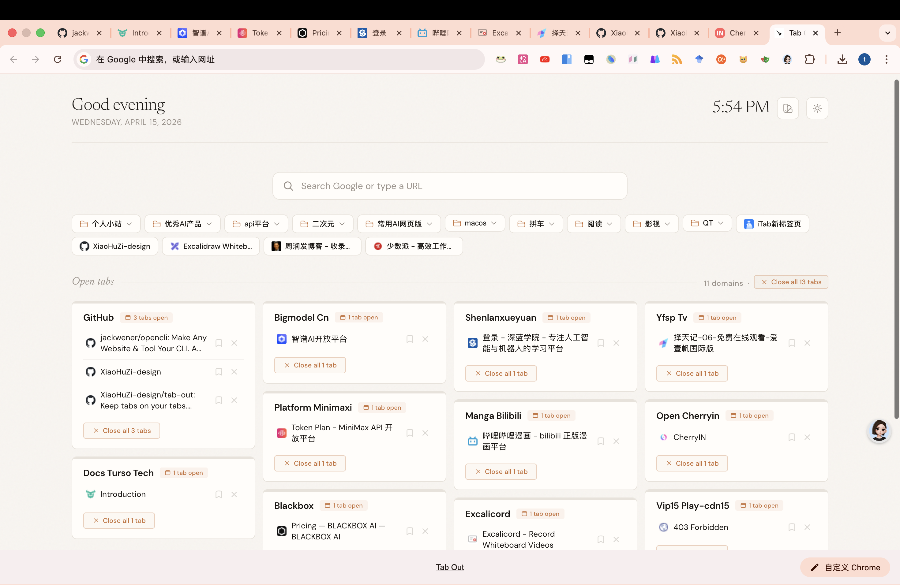

# Tab Out

[English](README.md)

**轻松管理你的标签页。**

Tab Out 是一个 Chrome 扩展，用清爽的仪表盘替换你的新标签页。所有打开的标签页按域名自动分组，首页（Gmail、X、LinkedIn 等）会归入独立卡片。关闭标签页时伴随舒适的 swoosh 音效 + 彩纸动画。

无需服务器、无需账号、不调用任何外部 API。只是一个纯粹的 Chrome 扩展。

---

## 预览

<p align="center">
  
</p>

---

## 使用编程助手安装

把本仓库地址发给你的编程助手（Claude Code、Codex 等），说 **"安装这个"**：

```
https://github.com/zarazhangrui/tab-out
```

助手会引导你完成安装，大约 1 分钟。

---

## 功能

### 原版功能

- **一览全部标签页** 网格布局，按域名自动分组
- **首页聚合** 将 Gmail 收件箱、X 首页、YouTube、LinkedIn、GitHub 等首页合并到一张卡片
- **优雅地关闭标签页** 伴随 swoosh 音效 + 彩纸动画
- **重复标签检测** 自动标记重复打开的页面，一键清理
- **点击跳转** 点击标签标题直接跳转到对应标签页，支持跨窗口
- **稍后阅读** 关闭前收藏到清单，方便以后查看
- **Localhost 分组** 显示端口号，轻松区分本地开发项目
- **可展开分组** 默认显示前 8 个标签，点击"+N more"展开更多
- **100% 本地运行** 数据不会离开你的电脑
- **纯 Chrome 扩展** 无需服务器、Node.js、npm，加载即用

### 新增功能

- **Google 搜索栏** 在新标签页直接搜索 Google 或输入网址跳转
- **实时时钟** 顶部显示优雅的衬线字体时钟
- **暗色模式** 一键切换亮色/暗色主题，偏好自动保存
- **背景主题** 提供 Paper、Ocean、Forest、Sunset 四种配色，暗色模式下自动适配对应深色渐变
- **书签栏** 快速访问 Chrome 书签栏中的常用网站，带 favicon 图标

---

## 手动安装

**1. 克隆仓库**

```bash
git clone https://github.com/XiaoHuZi-design/tab-out.git
```

**2. 加载 Chrome 扩展**

1. 打开 Chrome，访问 `chrome://extensions`
2. 开启右上角的 **开发者模式**
3. 点击 **加载已解压的扩展程序**
4. 选择克隆仓库中的 `extension/` 文件夹

**3. 打开新标签页**

即可看到 Tab Out。

---

## 工作原理

```
打开新标签页
  -> Tab Out 展示按域名分组的所有标签页
  -> 首页（Gmail、X 等）自动归入顶部独立分组
  -> 点击标签标题直接跳转
  -> 关闭已完成的分组（swoosh + 彩纸）
  -> 关闭前收藏到稍后阅读清单
  -> 使用搜索栏搜索 Google 或输入网址
  -> 切换暗色模式或更换背景主题
  -> 从书签栏快速访问常用网站
```

所有功能都在 Chrome 扩展内运行，无需外部服务器，不发送任何数据。收藏的标签页、主题和暗色模式偏好存储在 `chrome.storage.local` 中。

---

## 技术栈

| 组件 | 技术 |
|------|------|
| 扩展框架 | Chrome Manifest V3 |
| 数据存储 | chrome.storage.local |
| 书签读取 | chrome.bookmarks API |
| 音效 | Web Audio API（纯合成，无需音频文件） |
| 动画 | CSS 过渡 + JS 彩纸粒子效果 |
| 主题系统 | CSS 自定义属性 + 暗色模式支持 |

---

## 许可证

MIT

---

灵感来自 [zarazhangrui/tab-out](https://github.com/zarazhangrui/tab-out) — 感谢原项目提供的思路与设计。
